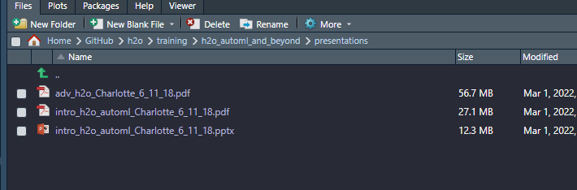
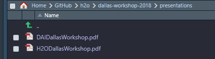
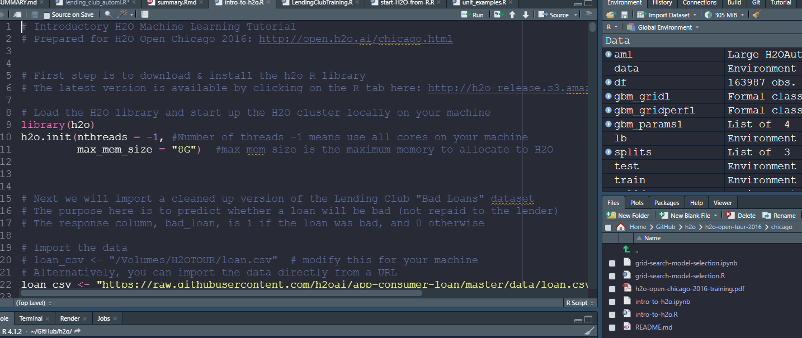
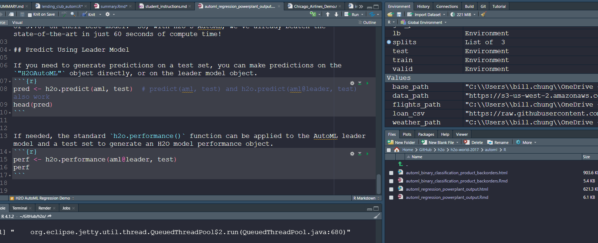

```{r setup, include=FALSE}
knitr::opts_chunk$set(echo = TRUE)
```

# Overview of H2o


```{r, echo=FALSE, fig.align='center', out.width="100%", fig.cap="5"}

```


## note

- The pdf contained information about how to use Driverless AI in $H2o$

```{r, echo=FALSE, fig.align='center', out.width="100%", fig.cap="1"}

```

# Models

## Binary 

- Used load data

```{r}
data_path <- "/home/h2o/data/topics/automl/loan.csv"
if (!file.exists(data_path)) {
  data_path <- "https://s3-us-west-2.amazonaws.com/h2o-tutorials/data/topics/automl/loan.csv"
}
```

### Binary example 1

```{r, echo=FALSE, fig.align='center', out.width="100%", fig.cap="2"}

```

### Binrary example 2

```{r, echo=FALSE, fig.align='center', out.width="100%", fig.cap="4"}

```

## Airline example

- The following workshop does not have data in it. 

```{r, echo=FALSE, fig.align='center', out.width="100%", fig.cap="2"}

```